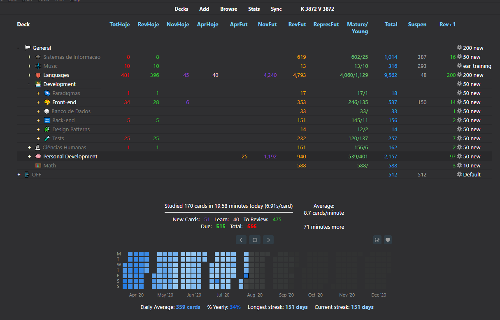
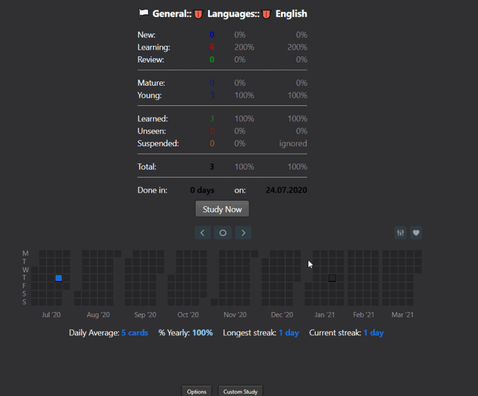
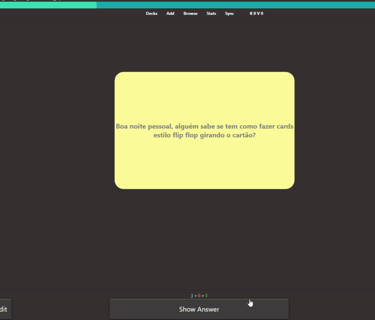
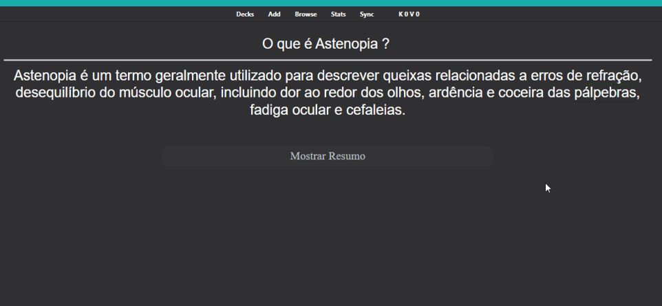

These are templates that I created using HTML, CSS AND JavaScript to be used with Anki Flashcards application, below are some examples.

 <b>My Main Screen on Anki</b> 

### Examples:

 <b>Dialog Note Type</b> 

 <b>Card with Flip Effect</b> 

 <b>Card with Tooltip</b> 

